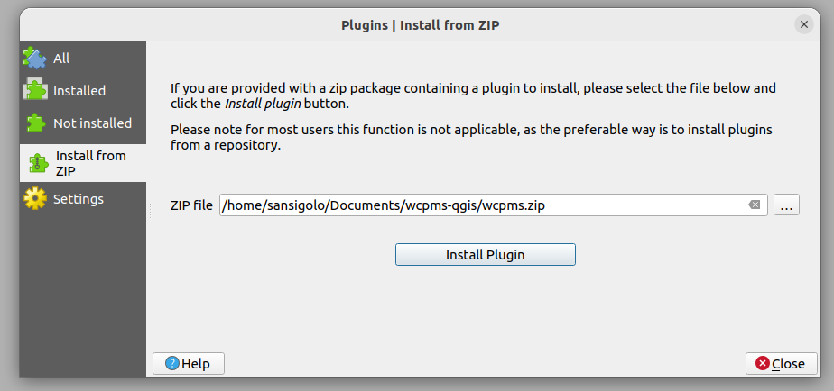

..
    This file is part of Python QGIS Plugin for WCPMS.
    Copyright (C) 2024 INPE.

    This program is free software: you can redistribute it and/or modify
    it under the terms of the GNU General Public License as published by
    the Free Software Foundation, either version 3 of the License, or
    (at your option) any later version.

    This program is distributed in the hope that it will be useful,
    but WITHOUT ANY WARRANTY; without even the implied warranty of
    MERCHANTABILITY or FITNESS FOR A PARTICULAR PURPOSE. See the
    GNU General Public License for more details.

    You should have received a copy of the GNU General Public License
    along with this program. If not, see <https://www.gnu.org/licenses/gpl-3.0.html>.

=================
User Installation
=================

The first step for commom users to install the plugin is download the latest release of zip file from `https://github.com/brazil-data-cube/wcpms-qgis/releases <https://github.com/brazil-data-cube/wcpms-qgis/releases>`_.

After download this file, start your QGIS and go to ``Plugins >> Manage and Install Plugins`` and install the plugin via zip by selecting the file and clicking in ``Install Plugin``.

...

.. note::

    After installation may occur some dependencies conflicts with python, there are some tips if this is the case in `Frequently Asked Questions <./faq.html>`_. But you can contact the team with BDC Team E-mail (`bdc.team@inpe.br <mailto:bdc.team@inpe.br>`_).
